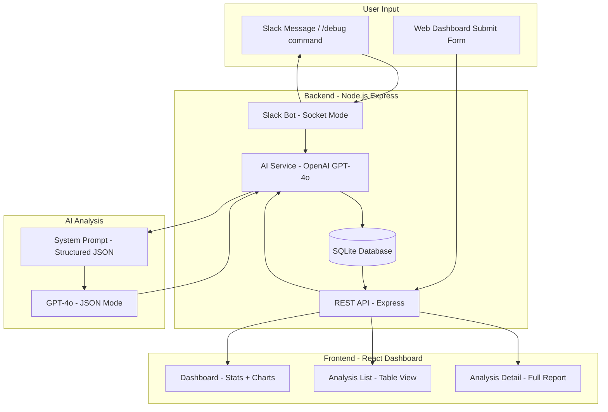
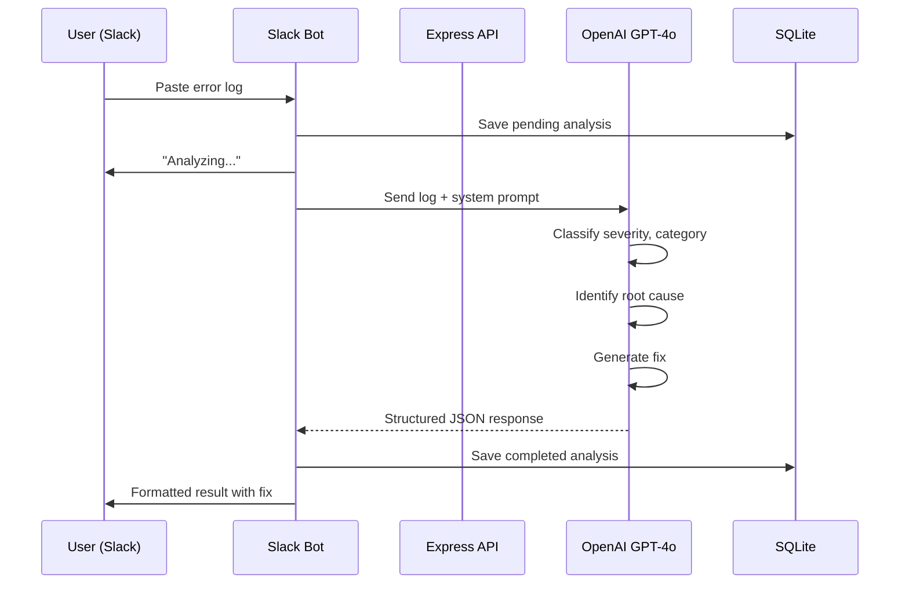
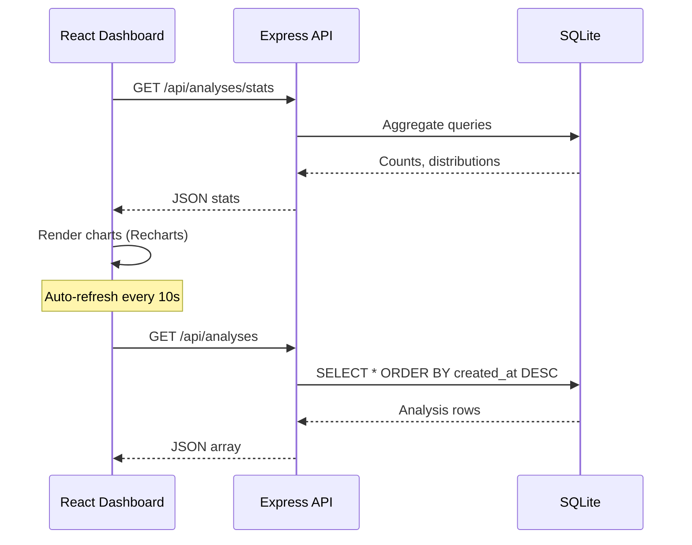

# DebugAI

AI-powered backend debugging and optimization agent. Paste error logs or describe performance issues in Slack, get back root cause analysis, severity classification, and code fixes. Everything shows up in a real-time dashboard.

## Architecture



## Request Flow



## Dashboard Data Flow



## Project Structure

```
debugai/
  CLAUDE.md              # Project-wide agent guidelines
  AGENTS.md              # Project-wide agent instructions
  UNDERSTANDING.md       # Plain English explanation of everything
  README.md              # This file
  backend/
    AGENTS.md            # Backend-specific agent instructions
    .env.example         # Required environment variables
    package.json
    src/
      index.js           # Entry point
      routes/
        health.js        # GET /api/health
        analysis.js      # CRUD for analyses
      services/
        ai.js            # OpenAI integration
        slack.js         # Slack Bot (Socket Mode)
        db.js            # SQLite setup + queries
      middleware/
        errors.js        # Global error handler
      prompts/
        system.js        # AI system prompt + Slack templates
    data/
      debugai.db         # SQLite database (auto-created)
  frontend/
    AGENTS.md            # Frontend-specific agent instructions
    package.json
    vite.config.js
    index.html
    src/
      main.jsx
      App.jsx            # Root component + navigation
      api.js             # All API calls
      components/
        Dashboard.jsx    # Stats, charts, recent list
        AnalysisList.jsx # Full analysis table
        SubmitForm.jsx   # Manual submission + examples
        AnalysisDetail.jsx # Single analysis view
```

## Setup

### 1. Get API Keys

**OpenAI** - https://platform.openai.com/api-keys

**Slack App** - https://api.slack.com/apps
- Create New App from scratch
- Enable Socket Mode (gives you App Token: xapp-...)
- Bot Token Scopes: chat:write, commands, im:history, im:read, im:write
- Install to workspace (gives you Bot Token: xoxb-...)
- Copy Signing Secret from Basic Information
- Optional: add /debug slash command

### 2. Backend

```bash
cd backend
cp .env.example .env
# Fill in OPENAI_API_KEY, SLACK_BOT_TOKEN, SLACK_SIGNING_SECRET, SLACK_APP_TOKEN
npm install
npm run dev
```

Runs on http://localhost:3001

### 3. Frontend

```bash
cd frontend
npm install
npm run dev
```

Runs on http://localhost:5173, proxies /api to backend.

## API

```
GET  /api/health           - Health check
GET  /api/analyses/stats   - Dashboard metrics
GET  /api/analyses         - List all analyses
GET  /api/analyses/:id     - Single analysis
POST /api/analyses         - Submit for analysis (body: { input_text })
```

## How the AI Agent Works

The system prompt constrains GPT-4o to return structured JSON with exactly these fields:

- **severity** - critical, high, medium, low, info
- **category** - runtime_error, performance, memory_leak, database, network, security, configuration, dependency, logic_error, other
- **root_cause** - what went wrong and why
- **suggestion** - step-by-step actionable fix
- **code_fix** - corrected code snippet if applicable
- **confidence** - 0.0 to 1.0

Temperature is 0.2 for consistency. JSON mode enforced so output is always parseable.

## Tech

- Node.js 18+, Express, @slack/bolt, OpenAI SDK, better-sqlite3
- React 18, Vite 6, Tailwind CSS 3, Recharts
- SQLite with WAL mode
- Slack Socket Mode (no public URL needed)
